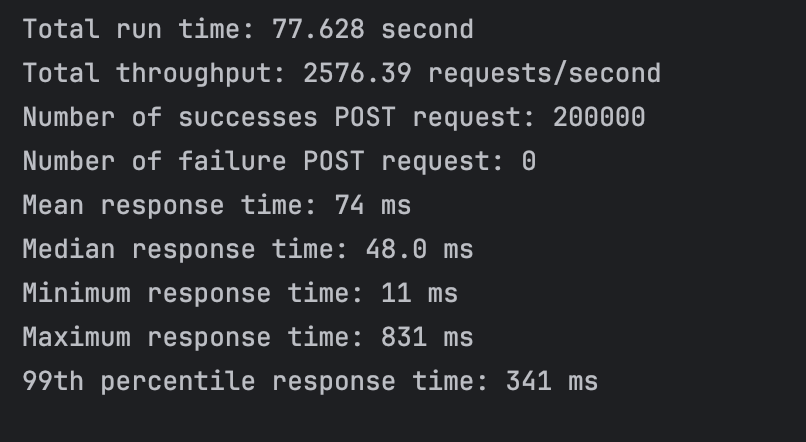
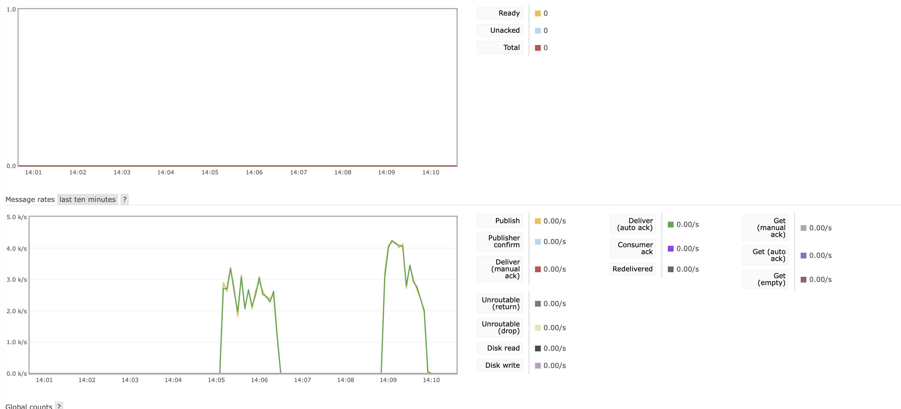
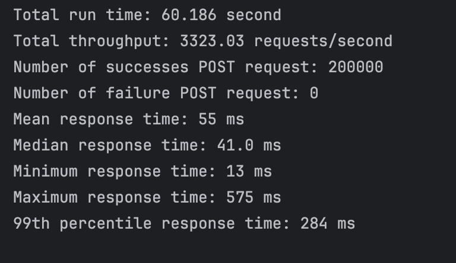
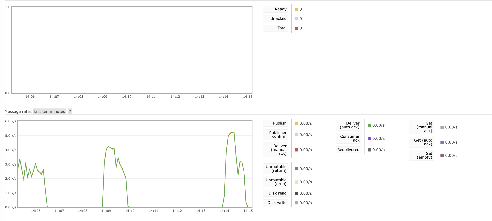
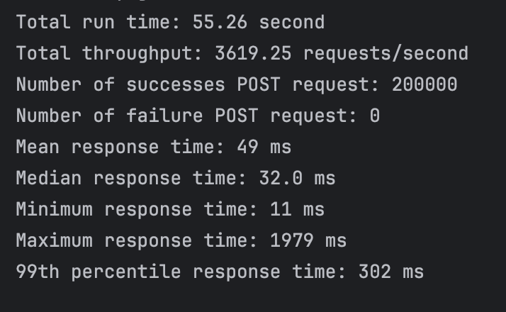
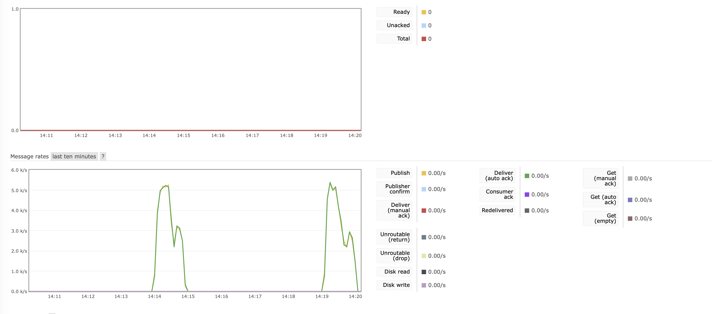
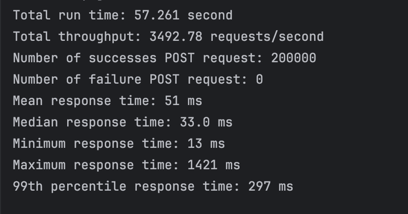

# CS6650 Assignment2

## Repo URL
[Link to GitHub](https://github.com/zhan-xl/CS6650-Assignment2.git)

## Server Design
The overall server design remain unchanged compare to Assignment 1. Within the post api, I have created a message called send message. This function creates a connection to the RabbitMq server, and post the message to the queue.

The server use HttpServlet package to creat api handlers. Currently there is only one servlet handles the "skier" route. In this servlet, it consists two api end points that are post and get. As the post request comes in, there is information coming as path parameters and body parameters. Two seperate methods called parseUrlPath and getBody are used to parse the informtation. Then the information is givien to a validation method. If the information provided did not pass the validation, the server will respose with a 400 status code. Upon validation, the server is send the message to RabbitMq and return status code 201(created).

## Client Design
There are also two changes that I made in the client part.

1. Instead of creating 32 threads initially, I have used a Executor Service to create a threads pool. By testing with different sizes of the threads pool, I found in general thee more threads the faster to finishes all the requests. As a result, I have created the threads pool with 200 threads.
2. Another change is to generate all ride information all at once. Initially, the ride infomation is generated as the post request is made. This way we do not have to allocate the space to store the 200k ride info. In this assignment, I traded in the space for faster run speed.

## Test Run Result

1. **Using a single servlet**

**Using a load balancer with 2 servlets**

**Using a load balancer with 3 servlets**

**Using a load balancer with 4 servlets**

## Conclusion
1. The queue was never overflow in all cases. After diggin into how rabbitmq consumer works, by default it run multi-threading to prevent overloading the queue. In all my senarios, the consumer is running 4 threads. We can change the defauld number of threads by using a Executore service.
2. With a load balancer, the differennce between 2 to 4 servlets is negligible.

